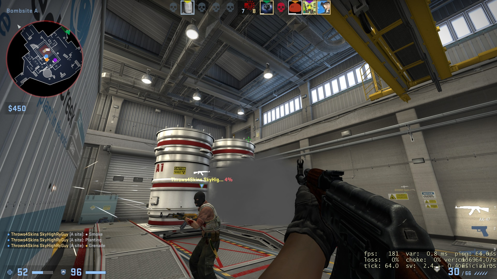

# My CSGO Settings
Turns out you can make some pretty decent improvements over default settings so
here are mine.

Add `-language textmodorel +exec autoexec.cfg` to launch options and merge the
csgo directory with the game install. This will overwrite some files that may be
restored by verifying game cache.

Major highlights:
* CSGO text mod by Orel ([Gamebanana source](https://gamebanana.com/mods/38438))
* Simple radar by aReDoNeHD ([Reddit source](https://old.reddit.com/r/GlobalOffensive/comments/pzyjfa/simple_radar_52_is_available_now_with_de_ancient/))
* Zoom the radar in and out with <kbd>-</kbd>/<kbd>=</kbd> (think <kbd>-</kbd>/<kbd>+</kbd>)
* Jumpthrow on <kbd>'</kbd>

## Screenshots

